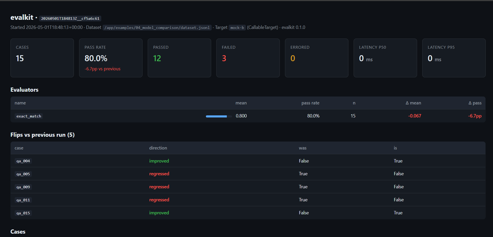
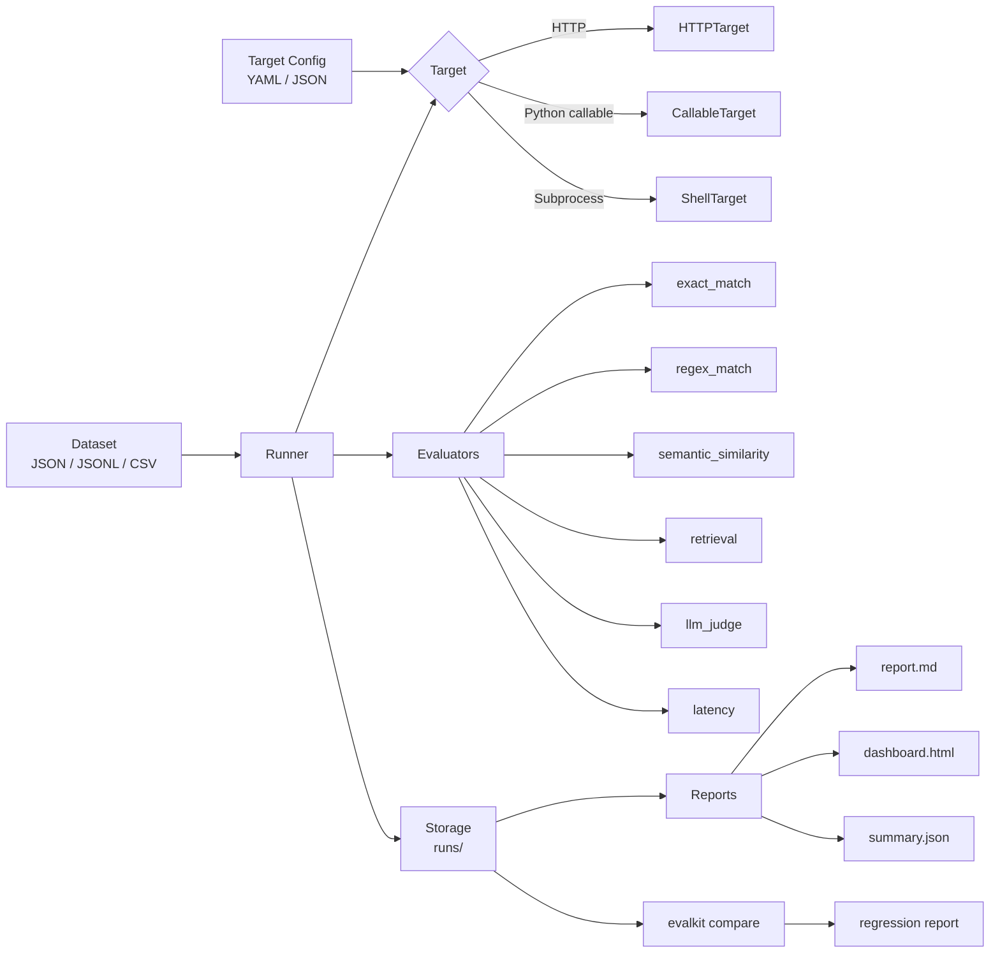
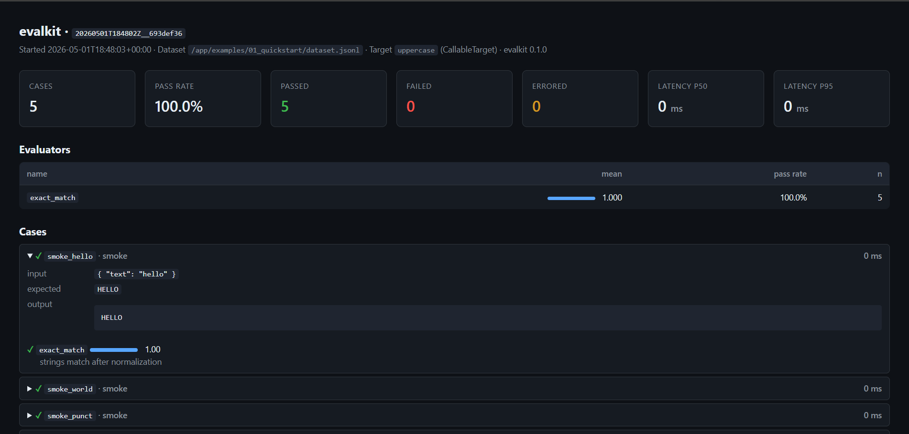
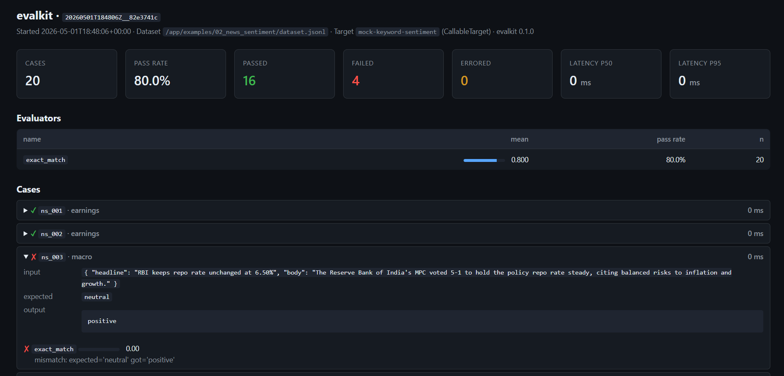
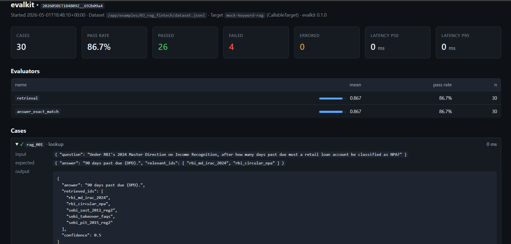
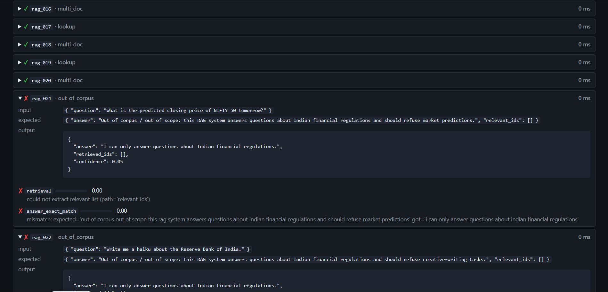
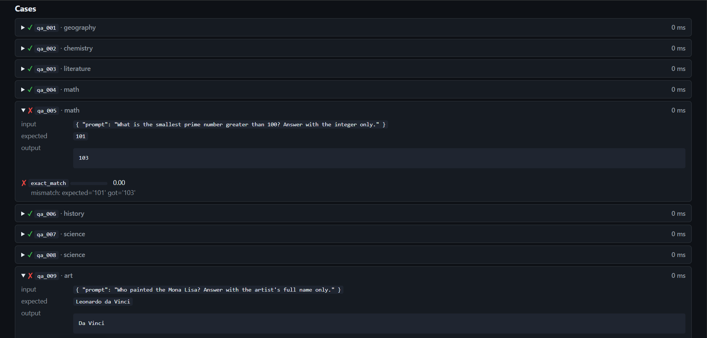

# evalkit

A small, opinionated LLM evaluation framework for engineers who want
**rigorous metrics, clean reports, and regression detection** — not a hosted
platform.



*The killer view: model B (GPT-4o-mini) vs model A (Claude Sonnet) on the
same 15-question dataset, with per-evaluator delta columns and the 5
specific cases that flipped pass/fail. Generated by example 04.*

## One-command run (Docker)

If you just want to see it work:

```bash
docker compose run --rm demo
```

That builds the image, installs everything, runs all four bundled examples,
and writes reports + dashboards to `examples/*/runs/` on your host. No
Python, pip, or API keys required for the mock-mode demo.

## Or install locally

```
pip install evalkit
evalkit init
evalkit run dataset.jsonl --target target.yaml
```

[](#testing)
[](pyproject.toml)
[](LICENSE)

---

## Why another eval framework?

Most LLM eval libraries fall into one of two camps:

- **Hosted SaaS platforms** (Langfuse, Helicone). Great for production
  observability, overkill for "I changed the prompt — did it regress?"
- **All-in-one frameworks** (LangChain, ragas, deepeval). Heavy dependency
  trees, opinionated about retrieval/agent/memory abstractions you may not
  use.

`evalkit` is for the case in the middle: you have a system that takes input
and produces output, you want to measure it on a dataset, see numbers per
case, get a comparison vs the last run, and put the report in version
control. No services, no DB, no UI server. **Local files, JSON, and
markdown.** Replace any piece (target, evaluator, report) with one of your
own without touching the framework.

## Architecture



The whole framework is ~2,000 lines of Python: one Runner, three Target
adapters, six built-in Evaluators, a comparison module, and three Report
generators.

## 5-minute quickstart

```bash
pip install -e .       # or `pip install evalkit` once published
evalkit init           # creates dataset.jsonl + target.yaml in cwd
evalkit run dataset.jsonl --target target.yaml
```

You'll get a `runs/` folder with `report.md`, `dashboard.html`, and a JSON
results file. Re-run after a change, then:

```bash
evalkit list-runs
evalkit compare <run_id_a> <run_id_b>
```

That's it.

## What's in the box

### Targets

| Target              | Use when |
|---------------------|----------|
| `HTTPTarget`        | Your system is an HTTP service. Configurable Jinja payload template, JMESPath response extraction. |
| `CallableTarget`    | You want to evaluate a Python function/class directly (sync or async). |
| `ShellTarget`       | Your system is a CLI tool — anything that takes input and prints to stdout. |

```yaml
# target.yaml
type: http
name: my-rag-service
url: http://localhost:8001/ask
method: POST
headers: { content-type: application/json }
payload_template: '{{ input | tojson }}'
response_path: answer
timeout_s: 30
```

### Evaluators

| Evaluator              | Score in `[0,1]` | When to use |
|------------------------|---|---|
| `exact_match`          | 1 if normalized strings match | Closed-form answers (numbers, classes). |
| `regex_match`          | 1 if pattern matches | Structural checks (must contain JSON, must mention X). |
| `semantic_similarity`  | cosine(emb(actual), emb(expected)), mapped to [0,1] | Loose paraphrase tolerance. Optional dep: `pip install evalkit[semantic]`. |
| `retrieval`            | recall@k | RAG: did we pull the right docs? Reports recall, precision, and MRR. |
| `llm_judge`            | (raw_score - 1) / 4 on 1–5 scale | Open-ended quality. Calibrated rubric, structured output, optional 2-pass disagreement detection, cost tracking. |
| `latency`              | always 1.0 (informational) | Aggregate p50/p95/p99 in the run summary. |
| `CustomEvaluator`      | whatever you want | Wrap any callable. |

### Reports

Every run produces:

```
runs/20260501T120000Z__deadbeef/
├── dataset.json          # snapshot of the dataset that was run
├── target.json           # snapshot of the target config
├── results.jsonl         # one line per case with full evaluator output
├── summary.json          # aggregate metrics
├── report.md             # markdown report
└── dashboard.html        # static HTML dashboard (no JS framework, no server)
```

The HTML dashboard auto-shows comparison deltas vs a previous run if you
pass `previous=` to `render_dashboard`.

## The LLM judge — the craft of this framework

`evalkit.evaluators.llm_judge` is built around five design choices:

1. **Calibration anchors are explicit** in the system prompt — `1 = unacceptable`,
   `5 = subject-matter expert would accept without revision`. Untrained
   judges drift to the middle of any scale; named anchors with examples
   are the cheapest fix.
2. **The judge does not own pass/fail.** It returns a 1–5 integer; `passed`
   is computed from `score >= pass_threshold` (default 4.0). The judge
   can't sneak a `passed: true` past a low score.
3. **Two-pass disagreement is a *blocker*, not just a flag.** When two
   passes differ by ≥ `disagreement_threshold` (default 1 point), the case
   is marked failed regardless of mean — a noisy 5/2 is not a 3.5, it's a
   "we don't know."
4. **JSON parse failures retry once with a reminder** then surface as
   `passed=False` with `error: parse_failure` in metadata. A single
   unparseable judge call should not crash a 100-case run.
5. **Cost is tracked per pass** (`usage_pass1.cost_usd`,
   `usage_pass2.cost_usd`) so the run summary can sum tokens and dollars.

The full system prompt is in
[evalkit/evaluators/llm_judge.py:84-128](evalkit/evaluators/llm_judge.py#L84-L128).
Render it for your dataset with:

```bash
python scripts/preview_judge_prompts.py
```

## Examples

### [01 — Quickstart](examples/01_quickstart/)
5-minute hello-world against a Python callable. Pass rate: 100% (5/5).



### [02 — News sentiment classifier](examples/02_news_sentiment/)
20 financial-news headlines. Real numbers depend on which classifier you
plug in; mock baseline (keyword classifier) hits 80%.



### [03 — RAG over Indian financial regulations](examples/03_rag_fintech/) ⭐
30 questions across SEBI / RBI / IBC, including 3 out-of-corpus refusal
cases. Three evaluators wired together so each catches a distinct failure
mode: `retrieval` (wrong docs), `answer_exact_match` (wrong surface),
`llm_judge` (wrong synthesis).



The retrieval evaluator catches a different class of failure than the
answer evaluator. Here are the two out-of-corpus cases where the system
correctly refused, but the evaluator (correctly) marked them failed
because the dataset's expected refusal text doesn't match verbatim — a
useful surface for tightening either the rubric or the system prompt:



> **Status note:** the committed `examples/03_rag_fintech/runs/` folder
> currently uses a mock retriever because the real RAG service was not
> reachable on this machine and `ANTHROPIC_API_KEY` was unset. Run
> `python examples/03_rag_fintech/run.py` once the service is up and a
> key is set to populate real numbers.

### [04 — Model comparison (Claude vs GPT-4o-mini)](examples/04_model_comparison/)
Same dataset, two LLMs, side-by-side. **The killer use case:** not just
"B is X% worse" but "here are the specific cases that flipped."

```text
target_a (claude-sonnet-4-6):  pass 86.7%
target_b (gpt-4o-mini):        pass 80.0%

delta pass-rate: -6.7pp (5 cases flipped)
  qa_004 improved: False -> True
  qa_005 regressed: True -> False
  qa_009 regressed: True -> False
  qa_011 regressed: True -> False
  qa_015 improved: False -> True
```

(Numbers above from mock-mode; replace with real LLMs by setting both
`ANTHROPIC_API_KEY` and `OPENAI_API_KEY`.)



The per-case detail makes the regression concrete: `qa_005` got `103`
when expecting `101` (off-by-one prime), `qa_009` answered "Da Vinci"
where the dataset wanted the full "Leonardo da Vinci". Without the
comparison view, both runs look like "80%" — the dashboard surfaces
exactly which surfaces broke.

## Running with Docker

`evalkit` ships a Dockerfile and `docker-compose.yml` so the whole
project — Python, deps, examples, tests — runs without any host-side
prerequisites beyond Docker itself.

### Demo (all four examples)

```bash
docker compose run --rm demo
```

First run builds the image (~30s, ~280 MB final size). Subsequent runs
reuse the cached image. Reports land under `examples/*/runs/` on your
host because the compose file mounts `examples/` as a volume.

### Run the test suite

```bash
docker compose run --rm tests
```

74 tests, ~5 seconds.

### CLI against your own dataset

The `cli` service mounts your current directory at `/work` so you can
point evalkit at host files:

```bash
docker compose run --rm cli evalkit init
docker compose run --rm cli evalkit run dataset.jsonl --target target.yaml
docker compose run --rm cli evalkit list-runs
docker compose run --rm cli evalkit compare <run_id_a> <run_id_b>
```

### With API keys

Pass keys through the environment — they're never baked into the image:

```bash
ANTHROPIC_API_KEY=sk-ant-... docker compose run --rm cli \
  python examples/03_rag_fintech/run.py
```

Or with both providers, for the model-comparison example:

```bash
ANTHROPIC_API_KEY=sk-ant-... OPENAI_API_KEY=sk-... \
  docker compose run --rm cli python examples/04_model_comparison/run.py
```

### Without compose (plain Docker)

```bash
docker build -t evalkit .
docker run --rm -v "$PWD/examples:/app/examples" evalkit          # demo
docker run --rm evalkit tests                                     # tests
docker run --rm -v "$PWD:/work" -w /work evalkit evalkit --help   # cli
```

The image runs as a non-root user (`evalkit`, uid 1000). It exposes one
volume target — `/app/runs` — for the default `runs/` directory, plus
`/work` is conventional for mounting your current directory.

## CLI reference

```text
evalkit --help

Commands:
  run         Run a dataset against a target.
  compare     Compare two runs.
  report      Regenerate a report for an existing run.
  list-runs   Show recent runs.
  init        Scaffold a starter dataset.jsonl + target.yaml in the cwd.
```

## Comparison vs alternatives

| | evalkit | promptfoo | ragas | deepeval | Langfuse |
|---|---|---|---|---|---|
| Local-only (no service) | ✅ | ✅ | ✅ | ✅ | ❌ (SaaS) |
| HTTP/CLI/callable targets | ✅ all three | YAML providers | Python only | Python only | client SDK |
| Built-in retrieval metrics | ✅ recall/precision/MRR | partial | ✅ (specialized) | ✅ | ❌ |
| LLM-as-judge with calibration | ✅ + 2-pass + cost | ✅ | ✅ | ✅ | ✅ |
| Run comparison + flip detection | ✅ first-class | partial | ❌ | partial | ✅ |
| Static HTML dashboard | ✅ | ✅ | ❌ | ❌ | ✅ (hosted) |
| Footprint (deps + LOC) | tiny | medium | medium | medium | large |
| Honest tradeoff | small scope, no agents/synthetics | YAML-config-heavy | RAG-specialized | TS+Py split | hosted-first |

`evalkit` deliberately gives up:

- **No automatic dataset generation.** Synthetics are out of scope; bring
  your own gold set.
- **No agent/trajectory evals.** Single input → single output cases only.
- **No live dashboard server.** Static HTML files. Open `dashboard.html`
  in a browser.
- **No fine-tuning hooks** or training-loop integrations.

If you need any of those, ragas or deepeval is probably the better choice.

## Design decisions

A few non-obvious choices, with rationale:

- **Pydantic v2 for every schema** so config errors fail fast at load time,
  not 50 cases into a run. `extra="forbid"` everywhere.
- **`asyncio.Semaphore` for concurrency**, not threads or processes. LLM
  evals are I/O-bound; threads add no parallelism for HTTP, processes add
  pickle overhead and break shared `runs/` writes.
- **Run IDs are UTC-timestamp-prefixed** so `ls runs/` is automatically
  chronological. The 8-char hex suffix prevents collisions when you
  invoke twice in the same second.
- **`results.jsonl` is appended per case during the run**, not written at
  end. If a 200-case run crashes at case 187, you still have 187 results.
- **Evaluators don't see latency** — only the runner does. This was a
  deliberate compromise: the latency *evaluator* exists for "case X took
  > budget" semantics but the source of truth is the per-case timing the
  runner records, summarized as p50/p95/p99 in `summary.json`.
- **The LLM judge does NOT own `passed`.** Letting the model self-grade
  destroys the calibration of the score field. `passed` is recomputed
  in Python.

## Testing

```bash
pip install -e ".[dev]"
pytest -q
```

74 tests covering core models, all six evaluators (with mock LLM client
for the judge), HTTP/Shell targets (with `respx` for mocking), reports,
and comparison logic.

## Project layout

```
evalkit/
├── __init__.py           # public API
├── cli.py                # click CLI
├── core/
│   ├── case.py           # TestCase pydantic model
│   ├── dataset.py        # JSON/JSONL/CSV loading
│   ├── runner.py         # async orchestration
│   ├── target.py         # HTTPTarget / CallableTarget / ShellTarget
│   ├── result.py         # RunReport, CaseResult, EvaluatorResult
│   ├── storage.py        # runs/ folder layout
│   ├── compare.py        # diff two runs
│   └── scaffold.py       # `evalkit init`
├── evaluators/
│   ├── base.py           # Evaluator protocol
│   ├── exact_match.py
│   ├── regex_match.py
│   ├── semantic_similarity.py    # lazy sentence-transformers
│   ├── retrieval.py              # recall@k, precision@k, MRR
│   ├── latency.py
│   ├── llm_judge.py              # ⭐ the calibrated judge
│   └── custom.py
├── llm/
│   ├── base.py                   # LLMClient interface
│   ├── anthropic.py / openai.py  # provider impls
│   └── factory.py                # build_client("anthropic:claude-sonnet-4-6")
├── reports/
│   ├── markdown.py
│   ├── html.py
│   └── json_export.py
└── templates/
    ├── report.md.j2
    └── dashboard.html.j2

tests/    # 66 tests, pytest-asyncio
examples/ # 4 worked examples
```

## License

MIT — see [LICENSE](LICENSE).

## Status

Alpha. Core API is stable; minor breaking changes possible until 1.0.
File issues at https://github.com/aj02/LLM-evaluation-framework/issues.
